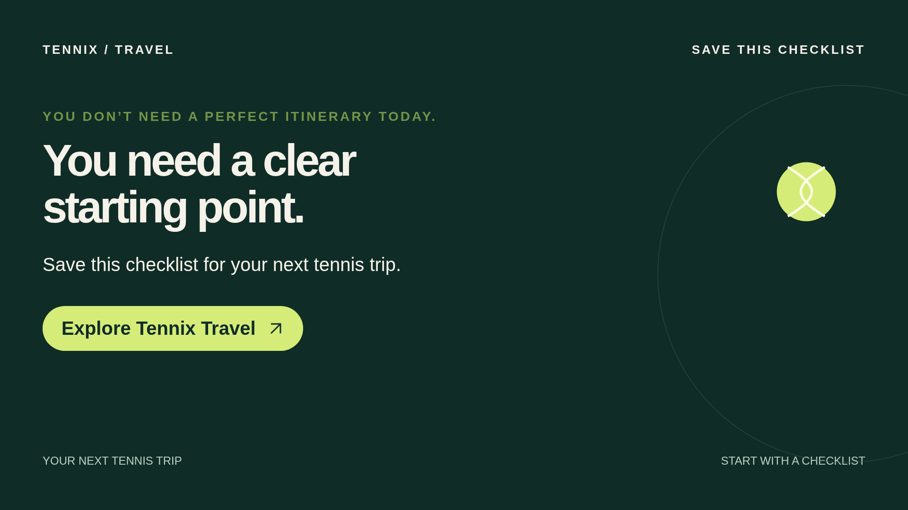

# Tennix Travel: Three checks before you book

An editable 60-second English (UK) video made with Remotion: 1920 × 1080, 30 fps, five scenes, original vector graphics and an offline guide voiceover using the supplied script.



## Watch the video

[Open or download the 60-second MP4](https://github.com/JhasseltCelis/All/raw/refs/heads/codex/tennix-travel-video/tennix-video/preview/tennix-travel.mp4). If your browser downloads it, open the downloaded file in your usual video player. No development tools are needed to watch.

## Open and edit the video

Install Node.js 22 or newer (validated with Node.js 24.19.0), then run from this folder:

```sh
npm ci
npm run dev
```

Open the address printed by Remotion Studio in your browser and select **TennixTravel**. Each of the five scenes also has its own timeline. Run `npm run lint` for ESLint and TypeScript validation.

## Download this project

On the branch page, choose **Code → Download ZIP**, extract the archive, and open the `tennix-video` folder. Installed dependencies and machine-specific tools are excluded; `npm ci` installs the pinned dependencies.

## Export an MP4

```sh
npx remotion render src/index.ts TennixTravel out/tennix-travel.mp4
```

## Production status

The supplied narration script, caption and newsletter copy are in [production.json](production.json). Original graphics are in `src/`, and the 60-second guide narration is in `public/voiceover.wav`.

The text wordmark is temporary and is **not the official logo**. The voiceover is a synthetic guide track. Replace both with approved production assets before release. The CTA destination is unconfirmed. The MP4 includes the temporary wordmark and synthetic guide narration.

See [PRODUCTION.md](PRODUCTION.md) for further details. Remotion licensing terms are available at https://www.remotion.dev/license.
